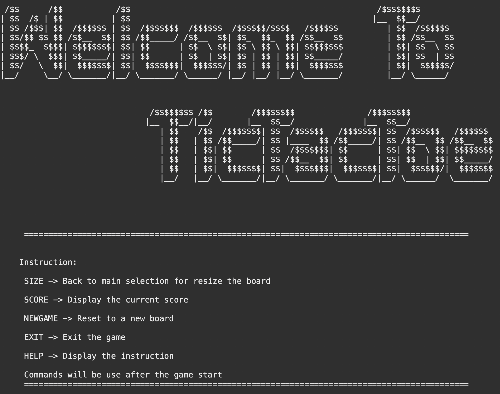

# Xs-Os


* [Objective](#objective)
* [How to use](#how-to-use)
* [Mandatory](#mandatory)
* [Bonus](#bonus)

## Objective
Create a Tic-tac-toe game. The game should accept two players and print \
a new board to the screen each time a player adds an X or O to the board. \ 
Once the game is complete and a winner is declared, give the option to restart the game. 

## How to use

```
cd ~
git clone https://github.com/JCTGY/Xs-Os.git
run the program
```

## Bonus
implement differnt size of board
implement commands for players to navigate
* MAIN -> Back to main selection for size
* SCORE -> Display the current score
* NEWGAME -> Reset to a new board
* EXIT -> Exit the game
* HELP -> Display the instruction
